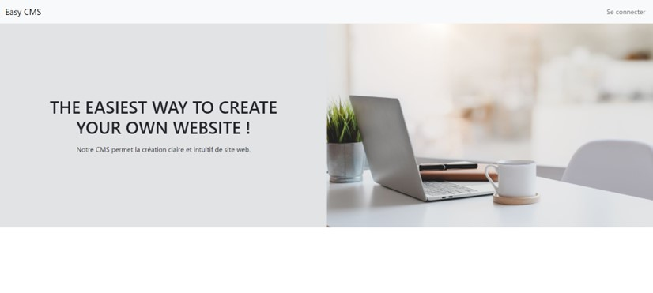
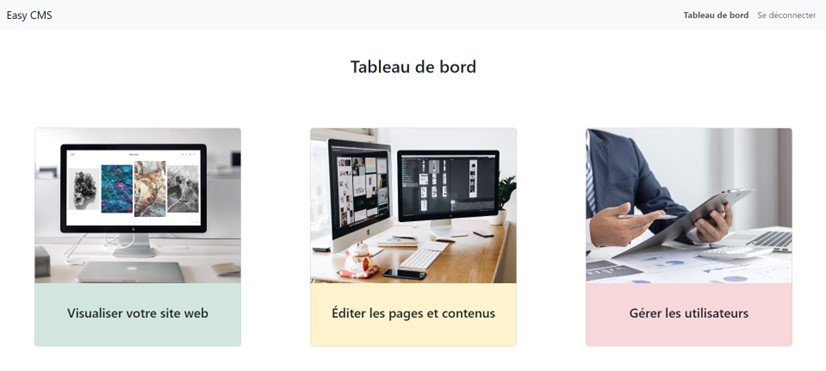
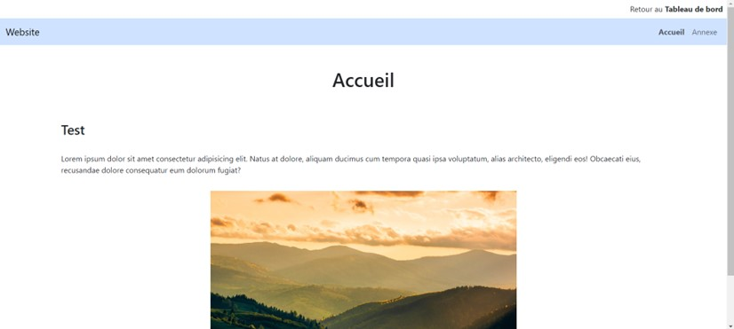
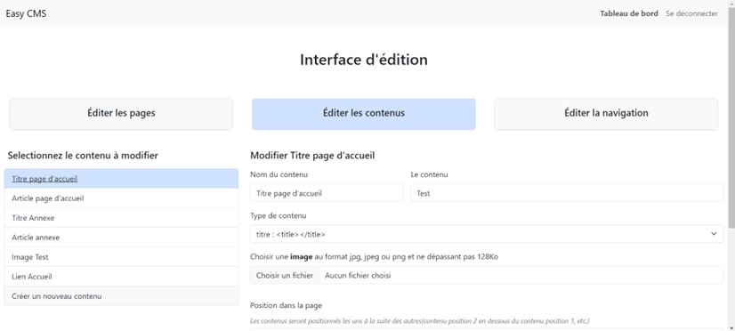
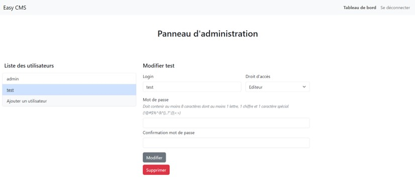

# Easy CMS

Ce projet a pour but de créer un socle initial pour la publication de contenu. Il s'agit d'un système de gestion de contenu (CMS) construit avec PHP et MySQL, utilisant l'architecture MVC, le moteur de templates Twig et le framework CSS Bootstrap.

## Fonctionnalités principales

- Interface d'édition pour gérer les pages, les contenus et la navigation du site.
- Gestion détaillée des contenus avec catégorisation par type : titres, articles, liens et images.
- Système de gestion des utilisateurs pour un contrôle d'accès différencié.
- Visualisation des pages publiées.

## Prérequis

- PHP 7.x ou plus récent
- MySQL 5.x ou plus récent
- Serveur local ou distant capable de servir des applications PHP et d'héberger une base de données MySQL

## Installation

Pour installer Easy CMS :

1. Importez la base de données MySQL à partir du fichier `db/easycms.sql`.
2. Configurez votre serveur web pour pointer vers le répertoire du projet.
3. Ajustez les paramètres de connexion à la base de données.

## Utilisation

À travers l'interface d'édition, les utilisateurs peuvent :

- Créer, modifier et supprimer des pages web.
- Gérer le contenu des pages, y compris les titres, les articles, les liens et les images.
- Structurer la navigation du site web.

En utilisant le panneau d'administration, il est possible de :

- Ajouter, modifier ou supprimer des comptes utilisateurs.
- Attribuer et gérer les niveaux d'accès des utilisateurs.

## Environnement de développement

- IDE : Visual Studio Code.
- Serveur web local : WampServer a été utilisé pour le développement sur Windows.

## Déploiement

Pour déployer Easy CMS sur un serveur distant, vous devrez :

1. Transférer les fichiers du projet sur le serveur.
2. Importer la base de données dans MySQL.
3. Configurer le serveur web pour servir l'application.

## Auteurs

- Beatriz Moura | BeaMoura0906

Ce projet a été réalisé individuellement dans le cadre pédagogique.

## Captures d'écran

## Auteur 

Beatriz Moura - Développement initial | @BeaMoura0906

Ce projet a été réalisé en cours de formation dans le cadre d'un BTS SIO option SLAM (2ème année).